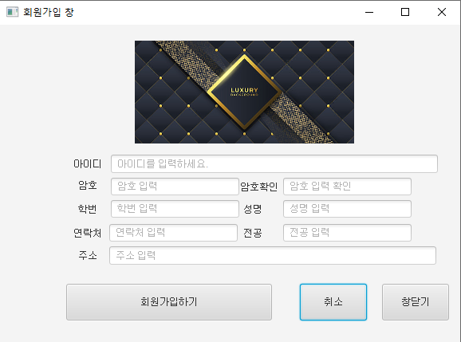
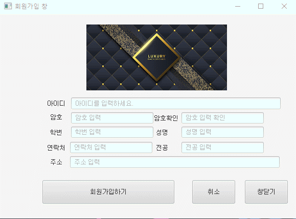

# -회원가입 화면(FXML)
## -luxury MemberShip

#### 회원가입 화면을 구성하였고 데이터 label을 다양하게 넣어보았습니다.

## -데이터 삽입

#### 일반 데이터는 텍스트 형식으로 주었고 비밀번호는 password filed를 사용하여 안보이도록 설정하였습니다.

# ✔느낀점
#### 아직 데이터 베이스를 연동하지 않아 회원가입이 되지 않지만 배운것을 응용하여 만든것에 의미를 두며 다음에는 데이터 베이스를 삽입하는것을 목표로 하겠습니다.